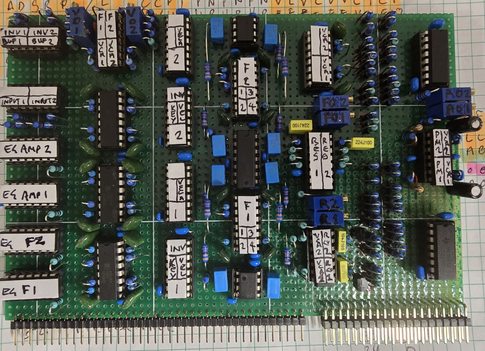

Schematics for a Shruthi / Electric Druid multipole filter, my take on it and adding the Shruthi pole switching on filter 1. 

VCA inputs for mixing of signals and an AS2164 VCA rather than the LM13700/600 option.

I built these filters on dual boards so half of each LM13600 is controlling resonance so an AS2164 was used for each VCA.

